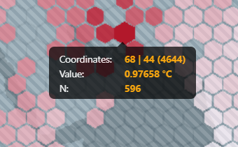

# Climate Difference Explorer

The Climate Difference Explorer is an interactive web application that enables users to investigate variations in temperature across two specified time ranges. This application is developed using TypeScript and utilizes WebGPU to provide efficient and performant visualizations.

## Data Source

The application uses the [_Climate Change: Earth Surface Temperature Data_](https://www.kaggle.com/datasets/berkeleyearth/climate-change-earth-surface-temperature-data) dataset, sourced from [Berkeley Earth](http://berkeleyearth.org/about/). This dataset includes historical average land temperatures dating back to 1750 and extending up to 2013, and is provided in CSV format. Specifically, the tool utilizes the _Global Land Temperatures By City_ data, which includes monthly temperature averages for various cities, as well as geographical coordinates (latitude and longitude) to enable data aggregation and visualization.

## Data Preprocessing

The Climate Difference Explorer uses a custom offline data processing pipeline to convert the raw CSV data into a format that is more suitable for the visualization. Furthermore, the pipeline also performs data compression to reduce the size of the data file, which is served to the client. The pipeline is implemented in Python and the resulting file is served to the client together with the application.

The preprocessing pipeline performs the following steps:

### Step 1: Data Interpolation

The first step in the pipeline is to interpolate the data to fill in missing average temperature values via linear regression. The interpolation is performed on a per-city and per-month basis, and is done by first computing a linear regression model utilizing existing values, and then using the model to predict the missing temperature values.

### Step 2: Data Compression

The second step in the pipeline is to compress the data by discretizing the temperature values, coordinates, and coordinates. The resulting data is then stored in a binary LZMA ([Lempel-Ziv-Markov chain algorithm](https://en.wikipedia.org/wiki/Lempel%E2%80%93Ziv%E2%80%93Markov_chain_algorithm)) compressed format, which is more compact than the original CSV format. This is done to reduce the size of the data file, which is served to the client.

## Visualization

A custom visualization is implemented using TypeScript and WebGPU to provide efficient and performant rendering. The code is transpiled to JavaScript and executed in the client browser.

The steps of the visualization pipeline are as follows:

### Step 1: Data Loading

In the first step, the compressed data file is loaded into memory and decompressed in the client browser by reversing the process described in the _Data Preprocessing_ section. The decompressed data is then transferred to the GPU using a WebGPU buffer.

### Step 2: Data Aggregation

The second step involves aggregating the data into a grid of hexagonal cells. This is done by using a WebGPU compute shader, which sums the temperature values within each cell for both time ranges to be compared, and then calculates the average temperature for each cell by dividing the sums by the number of data points. A second compute shader then finds the minimum and maximum values for the entire grid, which are used to determine the color shading of the grid cells.

### Step 3: Data Rendering

In the final step, a world map is rendered on the canvas. The hexagonal grid cells are then overlaid on the map and shaded according to the calculated temperature difference values. The resulting visualization provides a representation of the data that allows to quickly see trends in the temperature differences.

## User Interface

Since the WebGPU standard is still in its early stages of development, the application can currently only be used on the latest version of Google Chrome Canary.

After opening the application in the browser, the data is loaded and unpacked.

Once finished, the visualization is rendered on the canvas. The application is divided into three sections:

1. The **visualization**, which encompasses the entire screen and includes a legend, displays the selected data on a world map.
2. The **configuration window** allows users to select the year ranges to compare and adjust various display options.
3. The **information window** provides an overview of the currently displayed data, technical information, and a brief help guide.

### Visualization

The visualization groups the underlying data into hexagonal bins, each of which represents a specific geographic area. Data points within each bin are aggregated into a single value, which is then represented by the color of the hexagon. The color of the hexagon indicates the change in the average temperature by comparing the selected year ranges. The legend, which provides context for the colors used in the hexagons, is displayed at the bottom of the visualization. If a bin has no data points, it will appear transparent by default.

When the mouse cursor is placed over a hexagon, additional information about the bin is displayed as a tooltip. This information includes, among others, the grid coordinates of the bin and the exact value of the aggregated data points within the bin.

### Configuration Window

The configuration window is organized into three sections:

1. The **time selection** section allows to select the date ranges for comparison.
2. The **grid settings** section provides options for configuring the hexagonal grid in the visualization.
3. The **color settings** section allows to adjust the colors used in the visualization.

#### Time Selection

The time selection section enables users to select two year ranges for comparison. Users can select the start and end years for _Time Range A_ and _Time Range B_ using sliders. Additionally, a drop-down menu allows users to choose whether to compare the average temperature values for the entire year or for a specific month.

#### Grid Settings

The grid settings section of the configuration window allows to customize the hexagonal grid displayed in the visualization. The section includes sliders for adjusting the _Grid Scale_, which refers to the size of the individual hexagons of the grid, and _Grid Border_, which refers to the thickness of the border around each hexagon. Additionally, users can toggle on or off the equidistant grid option, which ensures that all sides of the hexagons have the same length. When the option is deselected, the hexagons will be distorted to match the aspect ratio of the underlying world map.

The _Grid Scale_ and _Grid Border_ settings affect the coverage of the hexagons on the world map, so when these settings are adjusted, the aggregation of the data points will be recalculated.

#### Color Settings

The color settings section allows users to switch between a sequential or a diverging color map using a drop-down menu. Sequential color maps use a progression of colors between two colors, while diverging color maps use two different colors that progress through a neutral color in the middle. Users can select the start and end colors of the gradient for both types of color maps using a color picker. Additionally, when using a diverging color map, users can also select the neutral color in the middle. The section also offers the option to use a symmetric variant for both color maps, which shows the same range of values at both ends of the scale. In addition, this section provides an option to customize the colors of the empty hexagons and the world map background.

### Information Window

The information window is organized into two sections:

1. The **general** section that displays information about the data currently being visualized.
2. The **help** section that offers a brief introduction to the application and its features.

#### General

This section displays statistical values about the visualized data, which include:

* **Visualization**
  1. _Maximum_, _Minimum_, and _Average_: The highest, lowest, and average value of the data points within the entire grid.
  2. _N_total_: The total number of data points currently aggregated.
* **Compute Times**
  1. _Aggregate_ and _Averaging_: Time taken by the compute shader to process the data.
  2. _Rendering_: Time taken for rendering the map and grid.
  3. _WriteBack_: Time taken for writing the aggregated data back to the main memory for client access.

#### Help

This section offers a brief overview of the application, including its features, data sources, and useful keyboard shortcuts.

